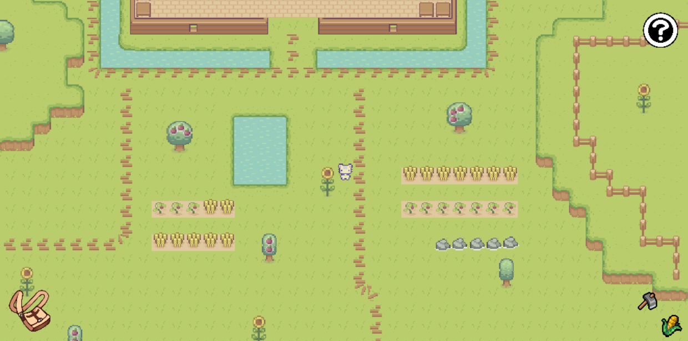
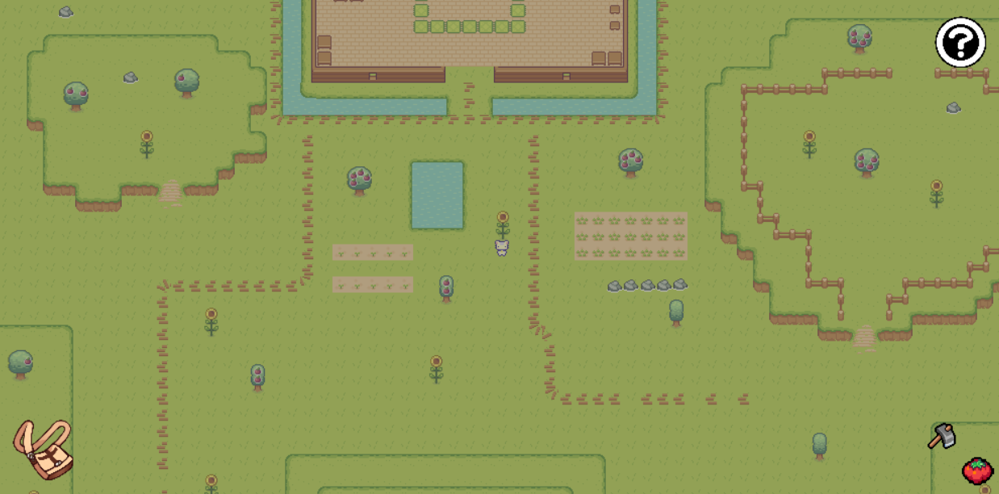
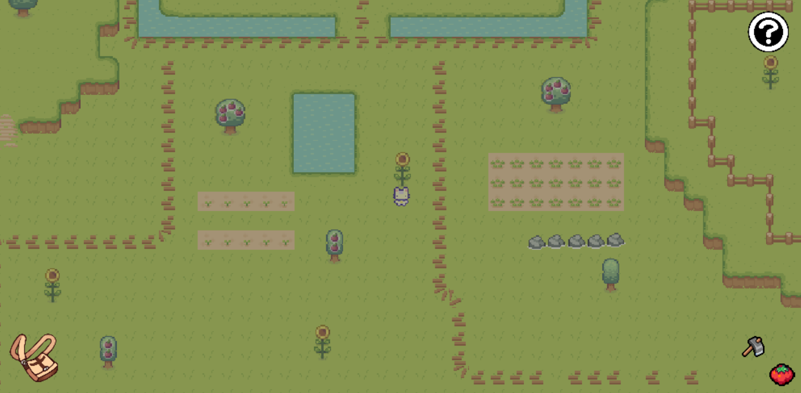
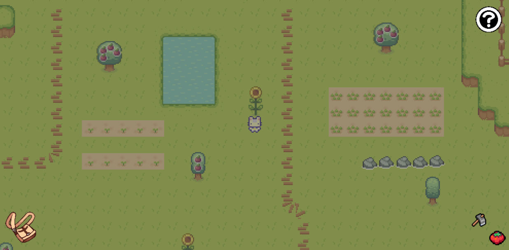
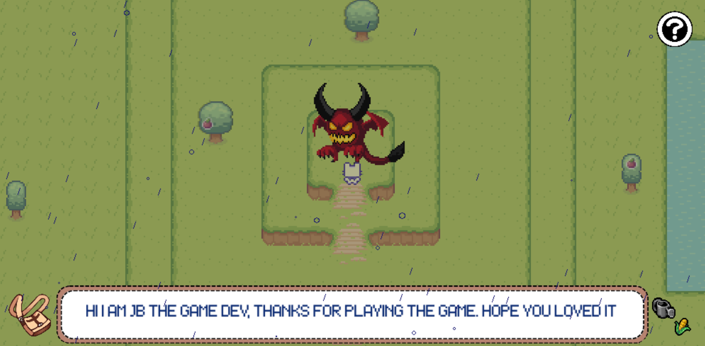
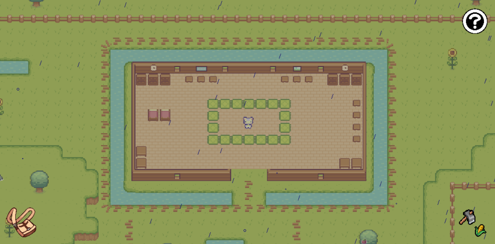

# 🌱 Sprout Lands Clone – Pygame Farming RPG

A **Pygame-based farming game** inspired by [this tutorial video](https://youtu.be/T4IX36sP_0c?si=Q0KohV4zttKS1PLx) by Clear Code.  
This version features several **custom enhancements** like:
- 🌧️ Rain drawn with Pygame's `draw` module
- 🌳 Extra sprites and trees
- 🎮 Player interactions with objects
- 🔍 Zooming in and out
- 📦 Inventory and help systems
- 🌗 Day-night cycle

---

## 📸 Screenshots

### Agriculture


### Zoom




### Interaction


### Rain


## 🎮 Features

- 🧑‍🌾 Farming mechanics (planting, watering, harvesting)
- ☔ Procedural rain drawn using `pygame.draw`
- 📦 Inventory system with UI
- ⛅ Dynamic weather and day-night cycle (if you added this)
- 📜 Help screen with key bindings
- 🔎 Zoom in/out support using scroll
- 🌳 More sprites and object interactions than original

---

## 🛠️ How to Run

### Requirements
- Python 3.8+
- `pygame` (install using pip)

```bash
pip install pygame
